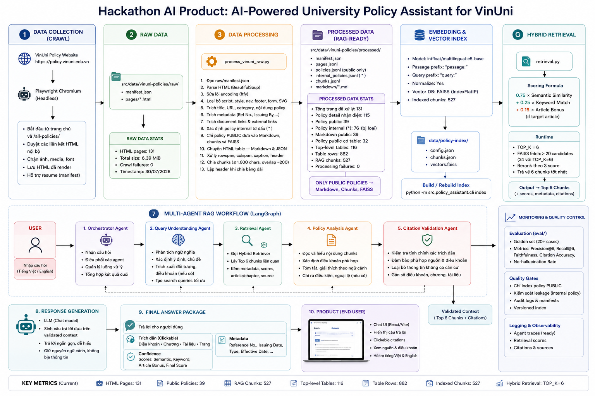

## Hackathon AI Product: AI-Powered University Policy Assistant - Draft Proposal

[Xem video demo trên Google Drive](https://drive.google.com/file/d/1GaneUmruVLcnmG1NKZFmineR38W0XrOF/view?usp=sharing)

UI Demo Version Draft:

### Team
- Teamname: PARIS
- Room: D303
- Thông tin thành viên
  
Tên | ID
---|---
Nguyễn Mai Thanh Trúc | 2A202601473
Nguyễn Thị Khánh Ly | 2A202601403
Nguyễn Thị Tuyết Mai | 2A202601693

### Hướng tiếp cận/Giải pháp

Hệ thống được xây dựng nhằm giải quyết bài toán **Legal Retrieval trong môi trường đại học**, hỗ trợ sinh viên, giảng viên và cán bộ tra cứu nhanh các quy chế, chính sách, quy định và thủ tục nội bộ.

Giải pháp kết hợp **Retrieval-Augmented Generation (RAG)** và kiến trúc **Multi-Agent** để tăng khả năng truy xuất chính xác, phân tích ngữ cảnh và kiểm chứng câu trả lời trước khi phản hồi cho người dùng.

### Kiến trúc hệ thống

### Tech Stack

| Thành phần | Công nghệ | Vai trò |
|---|---|---|
| **Frontend** | React 19, TypeScript, Vite 7 | Xây dựng giao diện trợ lý và kết nối API |
| **UI** | Lucide React, React Markdown, Remark GFM, CSS | Hiển thị hội thoại, Markdown và nguồn trích dẫn |
| **Backend** | Python, FastAPI, Uvicorn, Pydantic | Cung cấp REST API, validation và quản lý runtime |
| **Agent Framework** | LangGraph, LangChain | Điều phối workflow gồm hiểu câu hỏi, retrieval, phân tích chính sách, kiểm chứng citation và tạo phản hồi |
| **LLM** | OpenAI, Groq hoặc Google Gemini | Hỗ trợ nhiều provider, cấu hình qua biến môi trường |
| **Embedding** | `intfloat/multilingual-e5-base`, Sentence Transformers | Mã hóa ngữ nghĩa cho truy vấn và tài liệu Việt/Anh |
| **Vector Search** | FAISS `IndexFlatIP`, NumPy | Truy xuất vector kết hợp keyword, metadata và reranking |
| **Data Pipeline** | Playwright, Beautiful Soup, ftfy, PyPDF | Crawl HTML, lọc tài liệu public, xử lý bảng và chuyển đổi dữ liệu thành RAG chunks |
| **Evaluation** | Python evaluation scripts | Đánh giá retrieval, citation, evidence decision, ngôn ngữ và các regression case |
| **Deployment** | Docker, Docker Compose, Nginx | Đóng gói frontend/backend, reverse proxy `/api` và health check |

#### Cấu hình triển khai

- Frontend production được build bằng Node.js 22 và phục vụ qua Nginx.
- Backend chạy bằng Uvicorn trên cổng `8000`; frontend mặc định sử dụng cổng `5173`.
- Docker Compose quản lý backend, frontend, FAISS index volume và Hugging Face model cache.
- LLM provider, model, embedding model, `TOP_K`, CORS và cổng dịch vụ được cấu hình qua `.env`.

### Kết quả đầu ra

Hệ thống cung cấp:

* Câu trả lời dựa trên tài liệu chính thức.
* Trích dẫn chính xác đến điều khoản liên quan, tham chiếu đến nguồn chính thống.
* Hướng dẫn thực hiện thủ tục theo từng bước.
* Danh sách tài liệu hoặc biểu mẫu cần chuẩn bị.
* Mức độ tin cậy của câu trả lời.
* Khuyến nghị liên hệ chuyên viên khi cần thiết.

### Giá trị cốt lõi

Giải pháp giúp giảm thời gian tra cứu quy định, hạn chế câu trả lời không nhất quán, hỗ trợ người dùng tiếp cận chính sách đại học dễ dàng hơn và giảm khối lượng câu hỏi lặp lại cho các phòng ban hành chính.
