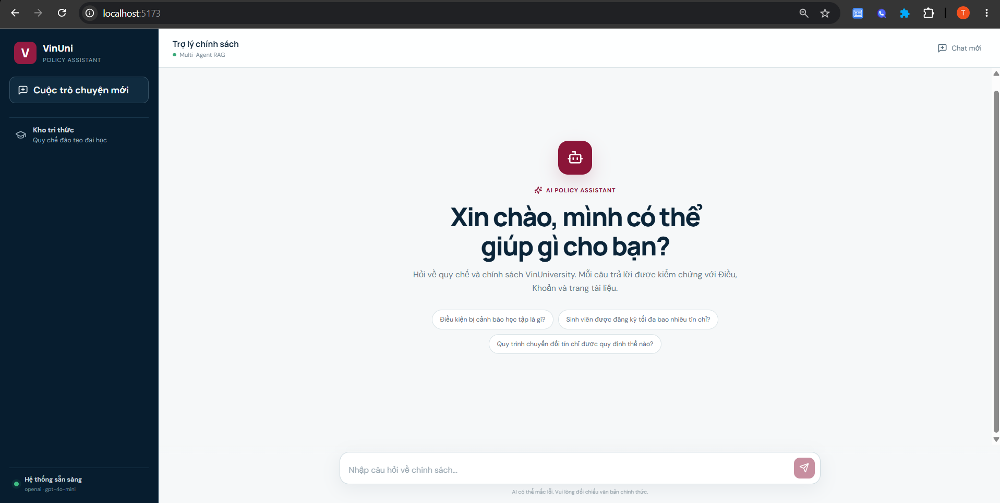
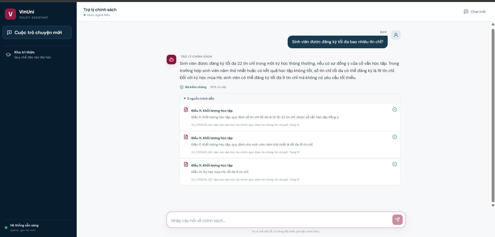
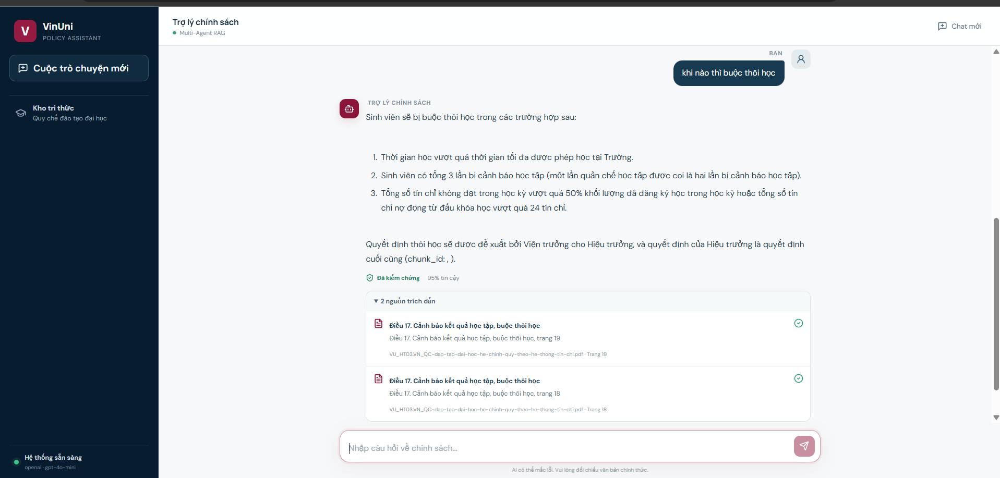

## Hackathon AI Product: AI-Powered University Policy Assistant - Draft Proposal

UI Demo Version Draft:

### Team
- Room: D303
- Thông tin thành viên
  
Tên | ID
---|---
Nguyễn Mai Thanh Trúc | 2A202601473
Nguyễn Thị Khánh Ly | 2A202601403
Nguyễn Thị Tuyết Mai | 2A202601693

### Hướng tiếp cận/Giải pháp

Hệ thống được xây dựng nhằm giải quyết bài toán **Legal Retrieval trong môi trường đại học**, hỗ trợ sinh viên, giảng viên và cán bộ tra cứu nhanh các quy chế, chính sách, quy định và thủ tục nội bộ.

Giải pháp kết hợp **Retrieval-Augmented Generation (RAG)** và kiến trúc **Multi-Agent** để tăng khả năng truy xuất chính xác, phân tích ngữ cảnh và kiểm chứng câu trả lời trước khi phản hồi cho người dùng.

### 6. Kết quả đầu ra

Hệ thống cung cấp:

* Câu trả lời dựa trên tài liệu chính thức.
* Trích dẫn chính xác đến điều khoản liên quan.
* Hướng dẫn thực hiện thủ tục theo từng bước.
* Danh sách tài liệu hoặc biểu mẫu cần chuẩn bị.
* Mức độ tin cậy của câu trả lời.
* Khuyến nghị liên hệ chuyên viên khi cần thiết.

### Giá trị cốt lõi

Giải pháp giúp giảm thời gian tra cứu quy định, hạn chế câu trả lời không nhất quán, hỗ trợ người dùng tiếp cận chính sách đại học dễ dàng hơn và giảm khối lượng câu hỏi lặp lại cho các phòng ban hành chính.
